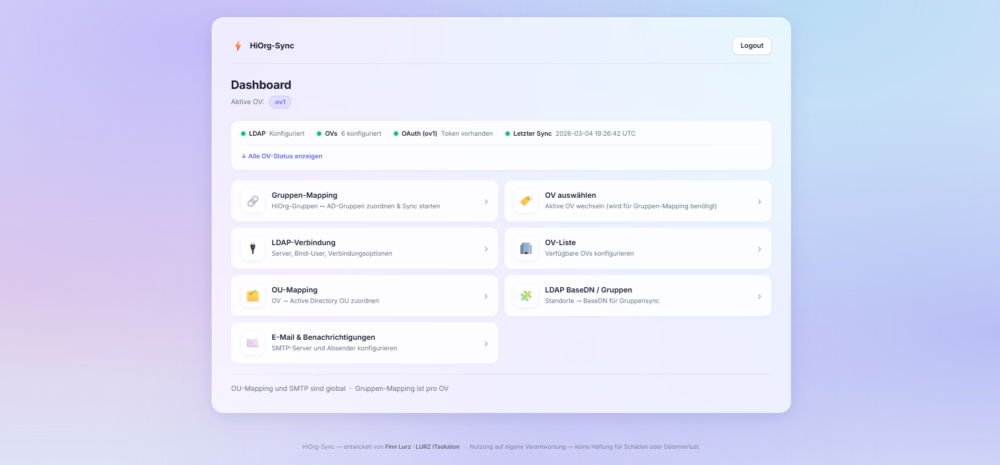
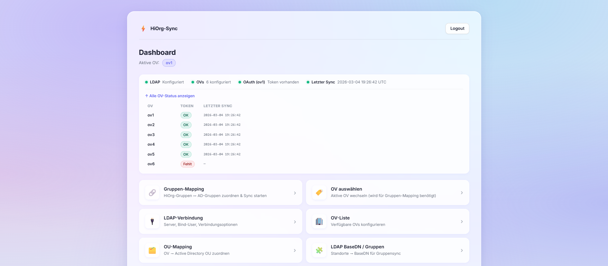

# HiOrg-Sync

**HiOrg-Sync** synchronisiert Personen- und Gruppendaten aus [HiOrg-Server](https://www.hiorg-server.de/) automatisiert in ein Active Directory / LDAP. HiOrg wird zur führenden Datenquelle (*Single Source of Truth*) — das AD spiegelt diesen Stand konsistent, inkrementell und nachvollziehbar wider.

---

## Inhaltsverzeichnis

- [Features](#features)
- [Screenshots](#screenshots)
- [Architektur](#architektur)
- [Schnellstart mit Docker](#schnellstart-mit-docker)
- [Manuelle Installation](#manuelle-installation)
- [Konfiguration](#konfiguration)
- [Nutzung & UI](#nutzung--ui)
- [Erster Sync & OAuth-Autorisierung](#erster-sync--oauth-autorisierung)
- [API-Referenz](#api-referenz)
- [Troubleshooting](#troubleshooting)
- [Leitprinzipien](#leitprinzipien)
- [Lizenz](#lizenz)

---

## Features

| Feature | Beschreibung |
|---|---|
| **Inkrementeller Sync** | Nur geänderte Datensätze werden verarbeitet (via `updated_since`-Marker) |
| **Vollsync** | Optionaler kompletter Abgleich aller Personen per API-Flag |
| **Gruppensync** | HiOrg-Gruppen → AD-Gruppen automatisch hinzufügen / entfernen |
| **Multi-OV** | Mehrere Organisationseinheiten (OVs) mit getrennten Tokens und Mappings |
| **OU-Mapping** | OV → Active Directory OU flexibel konfigurierbar |
| **Gruppenmapping-UI** | Abweichende AD-Gruppennamen (Umlaute, Präfixe) per UI lösbar |
| **sAMAccountName-Modi** | `hiorg_username` oder `vorname.nachname` — automatische Eindeutigkeitsprüfung |
| **Dry-Run** | Komplette Vorschau aller Änderungen vor dem Commit |
| **E-Mail-Benachrichtigungen** | Kontaktänderungen per SMTP melden (pro OV konfigurierbar) |
| **Web-UI** | Alle Einstellungen im Browser — kein Konfig-Datei-Chaos |
| **Docker-ready** | Einzelner Container, persistentes Datenvolume |

---

## Screenshots

| Login | Dashboard | OV-Auswahl |
|---|---|---|
|  |  |  |

---

## Architektur

```
HiOrg-Server (OAuth 2.0 API)
        │
        ▼
  HiOrg-Sync (FastAPI)
  ┌──────────────────────────────────┐
  │  OAuth-Flow  →  Token-Store      │
  │  Sync-Engine →  LDAP-Client      │
  │  Web-UI      →  Config-Store     │
  │  REST-API    →  GroupMap-Store   │
  └──────────────────────────────────┘
        │
        ▼
  Active Directory / LDAP
```

**Datenhaltung** (persistentes Volume `/var/lib/hiorg-sync`):

```
/var/lib/hiorg-sync/
├── tokens/          # OAuth-Tokens je OV (ov1.json, ov2.json, …)
├── markers/         # Sync-Zeitstempel je OV
├── groupmap/        # Gruppen-Mappings je OV
├── oauth_state/     # Temporäre OAuth-States
└── settings/
    ├── config.json  # LDAP BaseDN-Zuordnungen
    ├── ou_map.json  # OV → OU Mappings
    ├── email.json   # SMTP-Konfiguration
    └── ldap.json    # LDAP-Verbindungsparameter
```

---

## Schnellstart mit Docker

### 1. Repository klonen

```bash
git clone https://github.com/finnLurz/hiorg-sync.git
cd hiorg-sync
```

### 2. Konfiguration anlegen

```bash
cp .env.example .env
# .env mit echten Werten befüllen (siehe Konfiguration)
nano .env
```

### 3. Starten

```bash
docker compose up -d
```

Die Web-UI ist danach unter `http://<server-ip>:8088` erreichbar.

### 4. OAuth autorisieren

Für jede OV einmalig den OAuth-Flow durchführen:

```
http://<server-ip>:8088/oauth/start?ov=<ov-kürzel>
```

---

## Manuelle Installation

**Voraussetzungen:** Python 3.12+

```bash
git clone https://github.com/finnLurz/hiorg-sync.git
cd hiorg-sync

pip install .

# Umgebungsvariablen setzen (oder .env Datei verwenden)
export UI_PASSWORD=sicher123
export HIORG_CLIENT_ID=...
# … weitere Variablen (siehe Konfiguration)

uvicorn hiorg_sync.main:app --host 0.0.0.0 --port 8088
```

---

## Konfiguration

Alle Einstellungen werden über **Umgebungsvariablen** gesetzt (`.env`-Datei oder Docker `env_file`). Viele Werte können zusätzlich über die Web-UI nachträglich angepasst werden.

### HiOrg OAuth

| Variable | Pflicht | Beschreibung |
|---|---|---|
| `HIORG_CLIENT_ID` | ✅ | OAuth Client-ID aus dem HiOrg-Entwicklerportal |
| `HIORG_CLIENT_SECRET` | ✅ | OAuth Client-Secret |
| `HIORG_REDIRECT_URI` | ✅ | Callback-URL, z.B. `https://hiorg-sync.example.com/oauth/callback` |
| `HIORG_AUTH_URL` | ✅ | HiOrg Autorisierungs-Endpoint |
| `HIORG_TOKEN_URL` | ✅ | HiOrg Token-Endpoint |
| `HIORG_API_BASE` | ✅ | Basis-URL der HiOrg-API |
| `HIORG_SCOPE` | ✅ | OAuth Scopes, z.B. `openid profile` |
| `STATE_SECRET` | ✅ | Zufälliger String zur CSRF-Absicherung des OAuth-Flows |

### Allgemein

| Variable | Standard | Beschreibung |
|---|---|---|
| `DATA_DIR` | `/var/lib/hiorg-sync` | Verzeichnis für persistente Daten (Tokens, Marker, Settings) |
| `OV_LIST` | — | Komma-getrennte Liste der OV-Kürzel, z.B. `ov1,ov2,ov3` |
| `INITIAL_SYNC_DAYS` | `30` | Wie viele Tage in der Vergangenheit beim ersten Sync berücksichtigt werden |
| `SYNC_API_KEY` | — | API-Key für den `/api/sync/ad/run`-Endpunkt |

### LDAP / Active Directory

| Variable | Standard | Beschreibung |
|---|---|---|
| `LDAP_URL` | — | LDAP-Server-URL, z.B. `ldap://dc.example.com` oder `ldaps://dc.example.com` |
| `LDAP_BIND_USER` | — | Bind-DN für LDAP-Verbindung, z.B. `CN=sync,OU=Service,DC=example,DC=com` |
| `LDAP_BIND_PASSWORD` | — | Passwort des Bind-Users |
| `LDAP_DEFAULT_DOMAIN` | — | Standard-Domäne für UPN, z.B. `example.com` |
| `LDAP_HIORG_ID_ATTR` | — | AD-Attribut für die HiOrg-ID (z.B. für Nextcloud-Mapping) |
| `LDAP_HIORG_ID_PREFIX` | — | Optionaler Präfix für den HiOrg-ID-Wert |
| `LDAP_OVERWRITE_EMPTY` | `false` | Leere LDAP-Felder mit HiOrg-Daten überschreiben |
| `LDAP_ONLY_STATUS_ACTIVE` | `true` | Nur aktive Mitglieder synchronisieren |
| `LDAP_CREATE_ENABLED` | `false` | Neue AD-User automatisch anlegen |
| `LDAP_MOVE_IF_OU_CHANGED` | `false` | User in neue OU verschieben wenn OV wechselt |
| `LDAP_UPDATE_SAM` | `false` | Bestehenden sAMAccountName aktualisieren |
| `LDAP_OU_MAP` | — | OV → OU Mapping als JSON-String (alternativ: UI) |
| `LDAP_SAM_MODE` | `hiorg_username` | sAMAccountName-Quelle: `hiorg_username` oder `vorname.nachname` |
| `LDAP_SAM_USERNAME_KEY` | `username` | HiOrg-Attribut für den Username (bei Modus `hiorg_username`) |
| `EXCLUDE_ORGAKUERZEL` | — | Komma-getrennte Orgakürzel die beim Sync ignoriert werden |

### Web-UI

| Variable | Standard | Beschreibung |
|---|---|---|
| `UI_PASSWORD` | — | Login-Passwort für die Web-UI (**Pflichtfeld**) |
| `UI_SESSION_SECRET` | — | Zufälliger String zur HMAC-Signierung der Sessions |
| `UI_SESSION_TTL_HOURS` | `12` | Session-Gültigkeitsdauer in Stunden |

---

## Nutzung & UI

### Ersteinrichtung (Reihenfolge)

1. **LDAP-Verbindung** konfigurieren → `/ui/settings/ldap-conn`
2. **OV-Liste** eintragen → `/ui/settings/ovs`
3. **OAuth autorisieren** für jede OV → `/oauth/start?ov=<kürzel>` (siehe [Erster Sync & OAuth-Autorisierung](#erster-sync--oauth-autorisierung))
4. **OU-Mapping** festlegen → `/ui/settings/ou-map`
5. **LDAP BaseDN** pro Standort eintragen → `/ui/settings/ldap`
6. **Gruppenmapping** konfigurieren → Aktive OV wählen → Gruppen laden & zuordnen
7. **Ersten Sync** ausführen

### Sync ausführen

**Über die UI (Gruppenmapping-Seite):**
- `Sync` — Inkrementeller Sync (nur Änderungen seit letztem Lauf)
- `Full Sync` — Alle Personen vollständig synchronisieren

**Über die API:**
```bash
curl -X POST http://<server>:8088/api/sync/ad/run \
  -H "X-API-Key: <SYNC_API_KEY>" \
  -d "ov=ov1"
```

**Automatisiert via Cron:**
```bash
# Alle 15 Minuten synchronisieren
*/15 * * * * curl -s -X POST http://localhost:8088/api/sync/ad/run \
  -H "X-API-Key: <key>" -d "ov=ov1"
```

---

## Erster Sync & OAuth-Autorisierung

Bevor der erste Sync laufen kann, muss sich ein **HiOrg-Organisations-Admin** einmalig pro OV über den OAuth-Flow authentifizieren. Dabei wird ein Token ausgestellt und dauerhaft gespeichert — danach läuft alles automatisch.

### Voraussetzungen

- `HIORG_CLIENT_ID`, `HIORG_CLIENT_SECRET` und `HIORG_REDIRECT_URI` sind in der `.env` konfiguriert
- Die `HIORG_REDIRECT_URI` (z.B. `https://hiorg-sync.example.com/oauth/callback`) muss **vom Browser des Admins erreichbar** sein — sie zeigt auf die laufende HiOrg-Sync-Instanz
- Wird ein Reverse-Proxy verwendet (z.B. nginx, Traefik), muss der Pfad `/oauth/callback` korrekt weitergeleitet werden

### Schritt 1 — OV-Liste konfigurieren

Zuerst die OV(s) in der UI eintragen, falls noch nicht geschehen:

```
http://<server-ip>:8088/ui/settings/ovs
```

OV-Kürzel eintragen (z.B. `ov1`) und speichern. Ohne eingetragene OV schlägt der OAuth-Flow mit `403` fehl.

### Schritt 2 — OAuth-Flow starten

Ein **HiOrg-Organisations-Admin** öffnet folgende URL im Browser:

```
http://<server-ip>:8088/oauth/start?ov=<ov-kürzel>
```

> Wird ein Reverse-Proxy mit öffentlicher Domain verwendet:
> ```
> https://hiorg-sync.example.com/oauth/start?ov=<ov-kürzel>
> ```

Der Browser wird automatisch zur **HiOrg-Login-Seite** weitergeleitet.

### Schritt 3 — Mit HiOrg-Admin-Account anmelden

Der Admin meldet sich mit seinem HiOrg-Account an. HiOrg zeigt eine Zustimmungsseite mit den angeforderten Berechtigungen (`personal:read`, `personal:add`, `personal:update`).

Nach der Bestätigung leitet HiOrg zurück zur `HIORG_REDIRECT_URI`. HiOrg-Sync empfängt den Autorisierungscode, tauscht ihn gegen einen Token und speichert ihn dauerhaft.

**Erfolgreiche Autorisierung** — Antwort im Browser:

```json
{"ok": true, "ov": "ov1", "stored": true, "next": "/sync/run?ov=ov1"}
```

Das Token wird unter `DATA_DIR/<ov>/tokens.json` gespeichert und automatisch erneuert.

### Schritt 4 — Ersten Sync starten

Nach erfolgreicher Autorisierung kann der erste Sync angestoßen werden:

**Über die UI:** Dashboard → OV auswählen → Gruppen-Mapping → `Sync` oder `Full Sync`

**Oder direkt per API:**

```bash
curl -X POST http://<server>:8088/api/sync/ad/run \
  -H "X-API-Key: <SYNC_API_KEY>" \
  -d "ov=<ov-kürzel>&full=true"
```

> `full=true` empfiehlt sich beim allerersten Lauf, um alle Personen vollständig einzulesen.

### Hinweis: Token-Erneuerung

OAuth-Tokens werden automatisch per Refresh-Token erneuert. Ein erneuter manueller OAuth-Flow ist nur nötig wenn:
- der Refresh-Token abgelaufen ist (nach längerer Inaktivität)
- die HiOrg-App-Berechtigungen geändert wurden
- die Datei `DATA_DIR/<ov>/tokens.json` gelöscht wurde

In diesem Fall einfach Schritt 2–3 wiederholen.

---

## API-Referenz

Alle API-Endpunkte erfordern entweder:
- Header `X-API-Key: <SYNC_API_KEY>`, oder
- eine aktive UI-Session (Cookie `ui_session`)

### Sync

| Methode | Pfad | Beschreibung |
|---|---|---|
| `POST` | `/api/sync/ad/run` | AD-Sync starten. Body: `ov=<kürzel>&full=true` (optional) |
| `GET` | `/sync/run` | HiOrg-Daten abrufen (ohne AD-Schreib-Operationen) |

### Gruppen

| Methode | Pfad | Beschreibung |
|---|---|---|
| `GET` | `/api/groups` | Alle HiOrg-Gruppen der aktiven OV abrufen |
| `GET` | `/api/groupmap` | Aktuelles Gruppen-Mapping abrufen |
| `POST` | `/api/groupmap` | Gruppen-Mapping speichern (JSON-Body) |

### LDAP

| Methode | Pfad | Beschreibung |
|---|---|---|
| `GET` | `/api/ldap/locations` | Konfigurierte LDAP-Standorte (BaseDNs) abrufen |

### OAuth

| Methode | Pfad | Beschreibung |
|---|---|---|
| `GET` | `/oauth/start?ov=<kürzel>` | OAuth-Flow für OV starten |
| `GET` | `/oauth/callback` | OAuth-Callback (von HiOrg weitergeleitet) |

### Debug

| Methode | Pfad | Beschreibung |
|---|---|---|
| `GET` | `/debug/personal?ov=<kürzel>` | Rohdaten aus HiOrg-API anzeigen |
| `GET` | `/debug/admap?ov=<kürzel>` | Vorschau der AD-Attribut-Zuordnungen |

---

## Troubleshooting

### OAuth-Token fehlt oder abgelaufen

```
401 Unauthorized beim HiOrg-API-Aufruf
```
→ Neuen OAuth-Flow starten: `/oauth/start?ov=<kürzel>`
→ Im Dashboard: Status-Dot für OAuth zeigt rot → „Kein Token" bedeutet, der Flow wurde noch nicht durchgeführt oder das Token wurde gelöscht.
→ Vollständige Anleitung: [Erster Sync & OAuth-Autorisierung](#erster-sync--oauth-autorisierung)

### LDAP-Verbindung schlägt fehl

```
LDAP bind error: invalid credentials
```
→ Bind-User und Passwort in `/ui/settings/ldap-conn` prüfen. Für LDAPS: Zertifikat des Servers muss vertrauenswürdig sein.

### sAMAccountName-Konflikt

```
sAMAccountName already exists
```
→ HiOrg-Sync prüft Eindeutigkeit automatisch und hängt einen Zähler an (z.B. `max.mustermann2`). Prüfe `/debug/admap` für die geplante Zuordnung.

### Gruppen werden nicht synchronisiert

- OV korrekt ausgewählt? (Cookie in Browser)
- LDAP BaseDN für Standort eingetragen? (`/ui/settings/ldap`)
- Gruppenmapping gespeichert? (`/ui/groupmap` → Speichern)
- Gruppen-Sync ist in LDAP-Verbindungsoptionen aktiviert?

### Benutzer werden nicht angelegt

Standardmäßig ist `LDAP_CREATE_ENABLED=false`. Zum Aktivieren:
```env
LDAP_CREATE_ENABLED=true
```
Alternativ in der UI unter LDAP-Verbindung → "User automatisch anlegen" aktivieren.

---

## Leitprinzipien

**HiOrg ist führend — AD ist Zielsystem.**
HiOrg enthält die fachlich korrekten Informationen. AD/LDAP spiegelt diese Informationen technisch ab. Manuelle AD-Einträge werden beim Sync nicht gelöscht (außer bei Gruppen mit aktiviertem Entfernen).

**Inkrementell statt Vollsync.**
Pro Lauf werden nur Änderungen seit dem letzten Sync verarbeitet (`updated_since`-Marker). Das reduziert Laufzeit, API-Last und LDAP-Operationen.

**Kontrollierbarkeit und Transparenz.**
Dry-Run-Modus, Debug-Endpunkte und strukturierte Logs sorgen dafür, dass jede Änderung nachvollziehbar ist, bevor sie ausgeführt wird.

---

## Lizenz

Copyright © 2026 **Finn Lurz · LURZ ITsolution** — Alle Rechte vorbehalten.

Diese Software wird ausschließlich zur **privaten, nicht-kommerziellen Nutzung** bereitgestellt.

- ❌ Kommerzielle Nutzung, Verkauf oder entgeltliches Anbieten **nicht gestattet**
- ❌ Weitergabe oder Vertrieb an Dritte **nicht gestattet**
- ❌ Re-Branding oder Einbettung in kommerzielle Produkte **nicht gestattet**
- ✅ Privater Einsatz in eigenen Organisationen (Vereine, Hilfsorganisationen, Feuerwehren) erlaubt
- ✅ Anpassung des Quellcodes für den eigenen, internen Gebrauch erlaubt

Bei Verstößen behält sich der Urheber ausdrücklich vor, **zivilrechtliche und strafrechtliche Schritte** einzuleiten.

Die vollständigen Lizenzbedingungen sind in der Datei [`LICENSE`](LICENSE) einsehbar.
